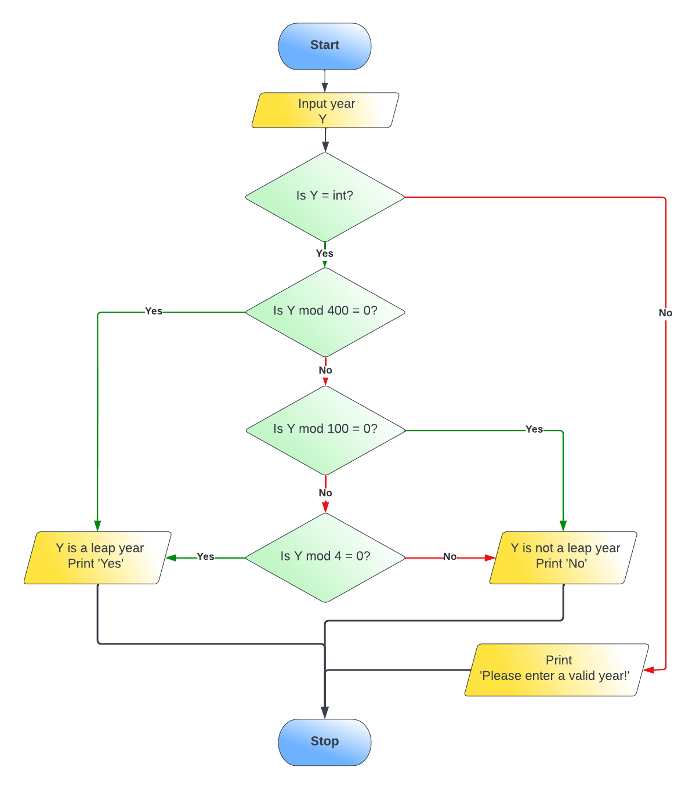
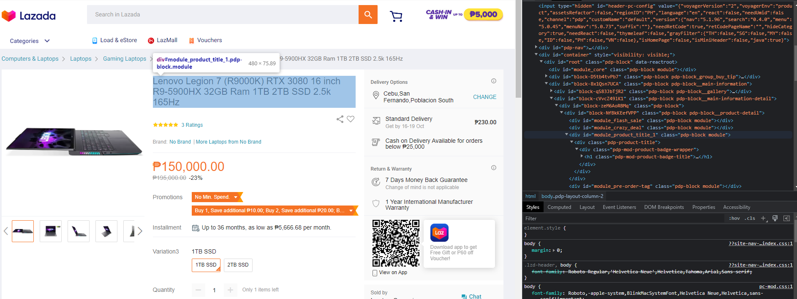
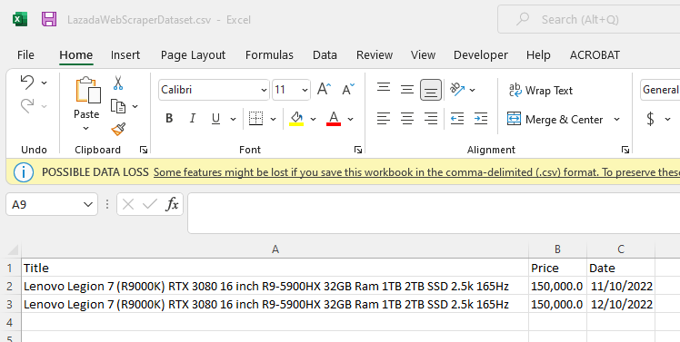

# **EUGENE MANUGAS**
*Mechanical Engineer turned Data Analyst*
   
   
   
**Hi There!** 
These are a few of the exercise projects I made as I dive deeper into data analytics.   
Feel free to view, replicate or use these codes. 

-------------------------------------------------------------------------------------------------------------------------------------------------------------------

# [Leap Year Checker - Python](https://github.com/eugenemanugas/Portfolio/blob/d84483c0b9262383d005474b025701cd568bf97c/Leap%20Year%20Checker%20Project/Leap%20Year%20-%20Python.ipynb)
What is a leap year?   
To be a leap year, the year number must be divisible by four – except for end-of-century years, which must be divisible by 400. This means that the year 2000 was a leap year, although 1900 was not. 2020, 2024 and 2028 are all leap years.

Let's start!

Given the definition, we need to create a logic for our solution.
Use Lucidchart to create a flowchart of the process.   

Add an integer check as well to capture incorrect input.   

We then create a pseudocode from the chart.   
```
Begin
    year = User inputs a year
    Check if year is an integer
    YES
        check if year is divisible by 400
        YES
            Say "Yes"
        NO
            check if year is divisible by 100
            YES
                Say "No"
            NO
                check if year is divisible by 4
                YES
                    Say "Yes"
                NO
                    Say "No"
    NO
        Say "Year entered is invalid"
End
```

Now, we need to convert this to code. Let's try Python.
Using Jupyter Notebook, I wrote this code to check if a year provided is a leap year or not.
```
### Leap Year Checker

#input year to check

year = input("Enter a year: ")

#check if input is an integer

try:
    year=int(year)

#leap years are century years divisible by 400 and non century years divisible by 4
#non leap years are century years divisible by 100 and non century years not divisible by 4

    if (year % 400 == 0):
        print("Yes")
    elif (year % 100 == 0):
        print("No")
    elif (year % 4 == 0):
        print("Yes")
    else:
        print("No")

except ValueError:  #triggered when year is not an integer
    print("Year entered is invalid!")
```

And here you go, a code that checks if the year provided is a leap year or not.
Copy and run this code in an IDE of your choice.

-------------------------------------------------------------------------------------------------------------------------------------------------------------------


# Web Scraper Project - Python
# [Lazada Item Price Drop](https://github.com/eugenemanugas/Portfolio/blob/d84483c0b9262383d005474b025701cd568bf97c/Web%20Scraper%20Project/Lazada%20Item%20Price%20Drop/Lazada%20Web%20Scraper%20Project.ipynb)
Have you ever had an item you liked but thought it could be priced better?   
You added it in your wishlist and checked on it everyday hoping for the price to drop at some point.   
Days passed and the price has not moved at all. Frustrating right?   
Let's make our code do the checking instead.

For instance, I really like this laptop from [Lenovo.](https://www.lazada.com.ph/products/lenovo-legion-7-r9000k-rtx-3080-16-inch-r9-5900hx-32gb-ram-1tb-2tb-ssd-25k-165hz-i2704888578-s12925837644.html?)


To start, you will need the URL, name and price of the item.

Inspect the webpage and navigate to where the price and title of the product are in the code.


Open a Jupyter Notebook instance and create a New Python 3 notebook.   
Name the notebook to your desired name, say "Lazada Web Scraper Project".

Import libraries as needed.   
Connect to the URL, parse the page and obtain your price and item title/name.   
Clean the obtained data and create as dataset.   
Create your csv and write a header for these data.   
Write your dataset.   

Your data should now look like this.   


From the previous codes, create an append function to append this dataset.   
Create an email funtion if you want to receive an email when the price drops.    
Now create a loop to check the price daily. Use the append function on the csv we created earlier.   
Run the loop in the background.   

You will now receive an email if the price goes lower than the previous price recorded.

For a detailed view of the code, click [here](https://github.com/eugenemanugas/Portfolio/blob/d84483c0b9262383d005474b025701cd568bf97c/Web%20Scraper%20Project/Lazada%20Item%20Price%20Drop/Lazada%20Web%20Scraper%20Project.ipynb)

-------------------------------------------------------------------------------------------------------------------------------------------------------------------


[My Repository](https://github.com/eugenemanugas/Portfolio)
